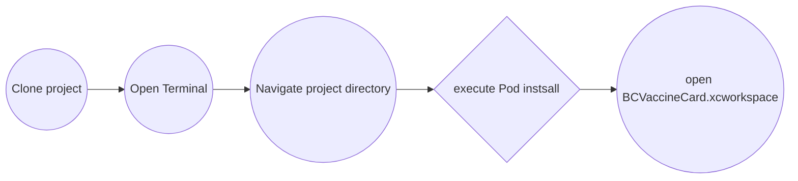
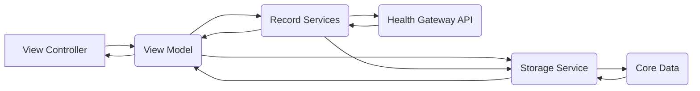

#  My Health BC

  

  

####  Health Gateway provides secure and convenient access to your B.C. health records all in one place. Keep track of what's important to you and your health.

  

 - **Health records**
Access your blood test and other lab results, medication history, immunization records, health visits and more.
  - **Poof of vaccination**
  Save proof of vaccination documents for you and your family. Have them ready for travel or to access events and services that require it.
  - **Health resources**
  Connect with HealthLink BC for health advice and get the latest information about COVID-19.

##  Table of Contents
- [Prerequisites](#Prerequisites)
- [Getting Started](#Getting-Started)
- [Libraries](#Libraries)
- [Deployment](#Deployment)
- [Architecture](#Architecture)
- [Resources](#Resources)
- [Contributors](#Contributors)
## Prerequisites
- [Xcode](https://developer.apple.com/xcode/) - IDE
- [Cocoapods](https://cocoapods.org/) - Dependency Manager

## Getting Started

## Libraries
- **[ IQKeyboardManagerSwift](https://github.com/hackiftekhar/IQKeyboardManager)**: keyboard manager
- **[AlamofireRSSParser](https://github.com/AdeptusAstartes/AlamofireRSSParserr)**: used for processing data
- **[SnowplowTracker](https://github.com/snowplow/snowplow-objc-tracker)**: used for tracking anonymous app analytics
- **[SwiftyJSON](https://github.com/SwiftyJSON/SwiftyJSON)**: used for processing data
- **[SwipeCellKit](https://github.com/SwipeCellKit/SwipeCellKit)**: siwpable cells
- **[SwiftQRCodeGenerator](https://github.com/fwcd/swift-qrcode-generator)**: used for generating QR svgs
- **[PocketSVG](https://github.com/pocketsvg/PocketSVG)**: Used for converting SVG into ios friendly formats
- **[BCVaccineValidator](https://github.com/bcgov/iOSVaccineValidator)**: validation library for BC vaccine cards
- **[EncryptedCoreData](https://github.com/project-imas/encrypted-core-data)**: storage encryption.
- ~~**[QueueITLibrary](https://github.com/queueit/ios-webui-sdk)**: used with some health gateway endpoints~~

## Deployment

###  Targets 
Switch between different environments by selecting the appropriate target:
- HealthGateway (PROD)
- HealthGatewayDev 
- HealthGatewayTest

### Automated
Github Actions have been setup for this project for handling the archive and upload of builds: 
- Pushes to the [dev](https://github.com/bcgov/myhealthBC-iOS/tree/dev) branch will trigger a [workflow](https://github.com/bcgov/myhealthBC-iOS/blob/main/.github/workflows/DevDeploy.yml) to create and upload a build to TestFlight
- Pushes to the [main](https://github.com/bcgov/myhealthBC-iOS/tree/main) branch will trigger a [workflow](https://github.com/bcgov/myhealthBC-iOS/blob/main/.github/workflows/DevDeploy.yml) to create and upload a build to TestFlight
  

### Manual
You can upload builds manually through Xcode, after obtaining the certificates from an admin of Government of British Columbia Apple account.
The certificates included in the repository are encrypted for use by the automated pipeline.

## Architecture
This application uses [UIKit](https://developer.apple.com/documentation/uikit) as its UI framework, and [Core Data](https://developer.apple.com/documentation/coredata/) with [encryption](https://github.com/project-imas/encrypted-core-data) as its storage option.

The diagram below shows the high level architecture:

Each ****health record type**** has its it own ****record service**** that handles the network calls, and storage of data through the ****Storage Service****
****Storage Service**** handles reads and writes from the core data database.

### Migrations
*The data for this application is completely wiped and re-fetched with each synchronization and the app is not required to hold onto data that hasn't been uploaded to the back end.
Because of this, the database doesn't require manual migrations.* 

**If there is a change in the Database structure, update the app version.**
If the app was updated, *or if there was any error with accessing the database*,  ****MigrationService**** will delete the sqlite file and generate a new one on application launch.

## Resources

### Health Gateway API
The documentation for the backend api is available through [Swagger.](https://dev.healthgateway.gov.bc.ca/swagger/index.html)
There are services for various sets of APIs:
- [Medication service](https://dev.healthgateway.gov.bc.ca/api/medicationservice/swagger/index.html)

- [Immunization Service](https://dev.healthgateway.gov.bc.ca/api/immunizationservice/swagger/index.htm")

- [Patient Service](https://dev.healthgateway.gov.bc.ca/api/patientservice/swagger/index.html)

- [Laboratory Service](https://dev.healthgateway.gov.bc.ca/api/laboratoryservice/swagger/index.html)

## Contributors
[Connor Ogilvie](https://github.com/ConnorOgilvie91) |
[Amir Shayegh](https://github.com/AmirShayegh) |
