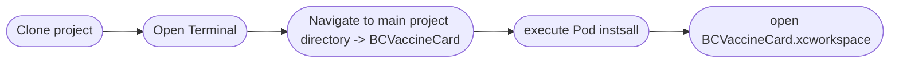

# Health Gateway

## Configuration

## Prerequisites
[Xcode](https://developer.apple.com/xcode/)
[Cocoapods](https://cocoapods.org/)

## Libraries
- **[ IQKeyboardManagerSwift](https://github.com/hackiftekhar/IQKeyboardManager)**: keyboard manager
- **[QueueITLibrary](https://github.com/queueit/ios-webui-sdk)**: used with some health gateway endpoints
- **[AlamofireRSSParser](https://github.com/AdeptusAstartes/AlamofireRSSParserr)**: used for processing data
- **[SnowplowTracker](https://github.com/snowplow/snowplow-objc-tracker)**: used for tracking anonymous app analytics
- **[SwiftyJSON](https://github.com/SwiftyJSON/SwiftyJSON)**: used for processing data
- **[SwipeCellKit](https://github.com/SwipeCellKit/SwipeCellKit)**: siwpable cells
- **[SwiftQRCodeGenerator](https://github.com/fwcd/swift-qrcode-generator)**: used for generating QR svgs
- **[PocketSVG](https://github.com/pocketsvg/PocketSVG)**: Used for converting SVG into ios friendly formats
- **[BCVaccineValidator](https://github.com/bcgov/iOSVaccineValidator)**: validation library for BC vaccine cards
- **[EncryptedCoreData](https://github.com/project-imas/encrypted-core-data)**: storage encryption.
